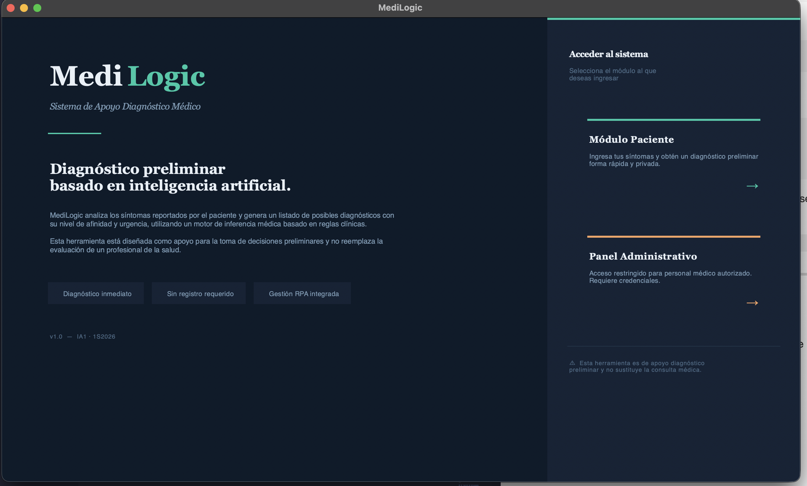
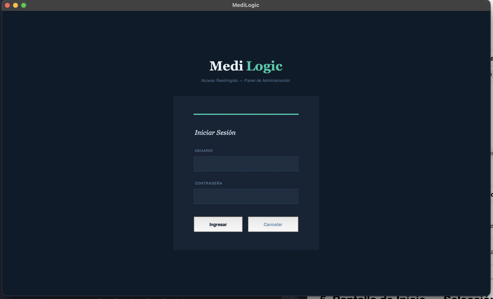
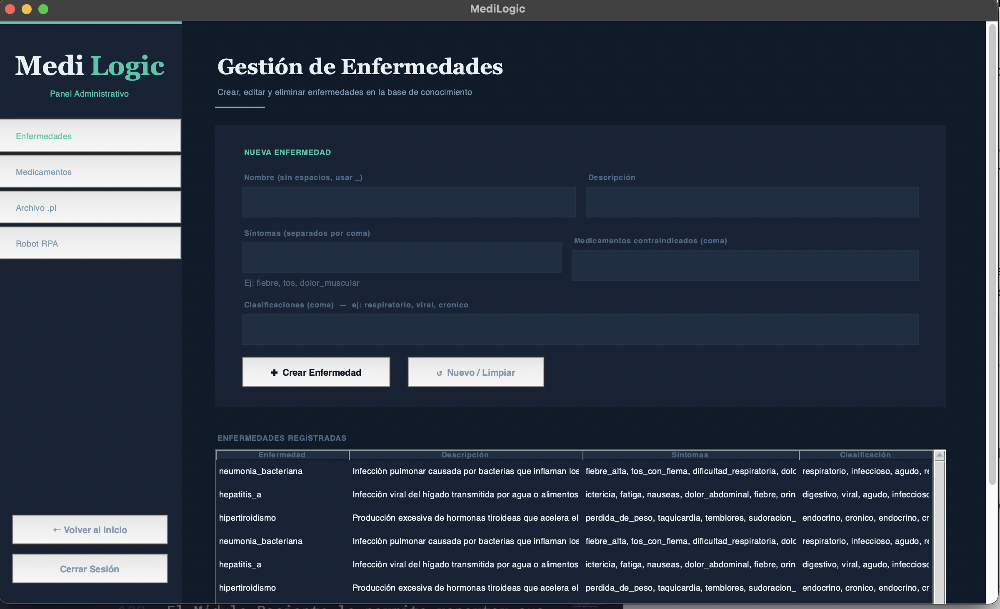
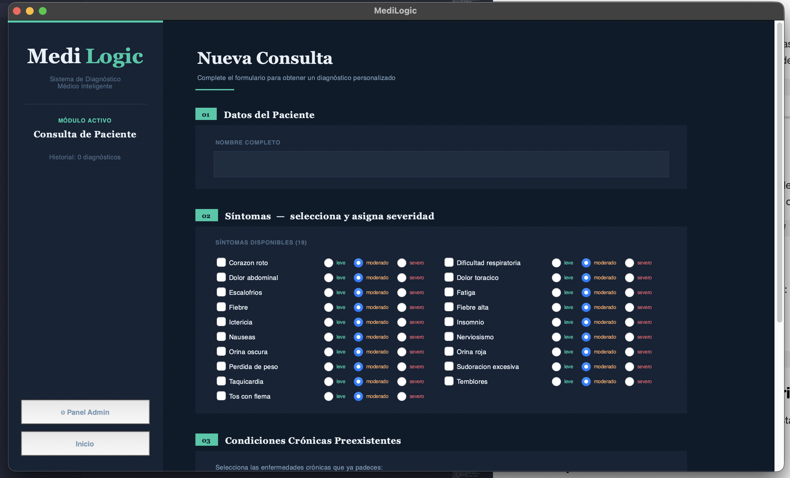
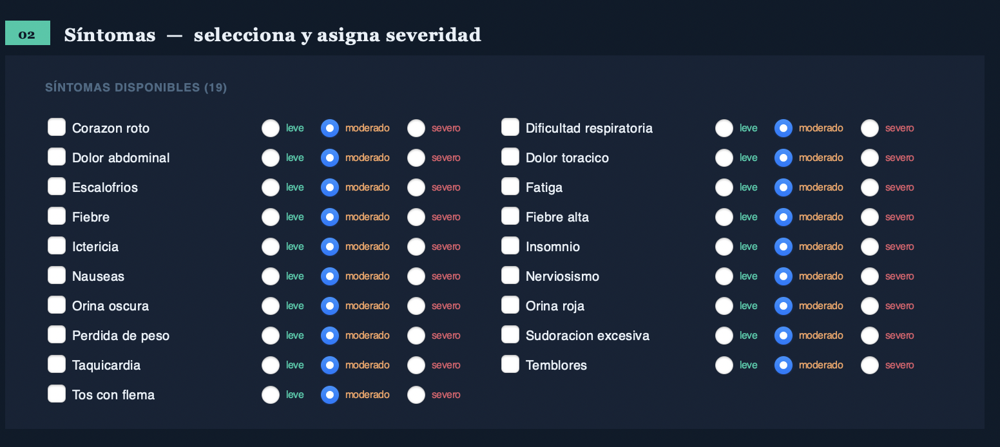
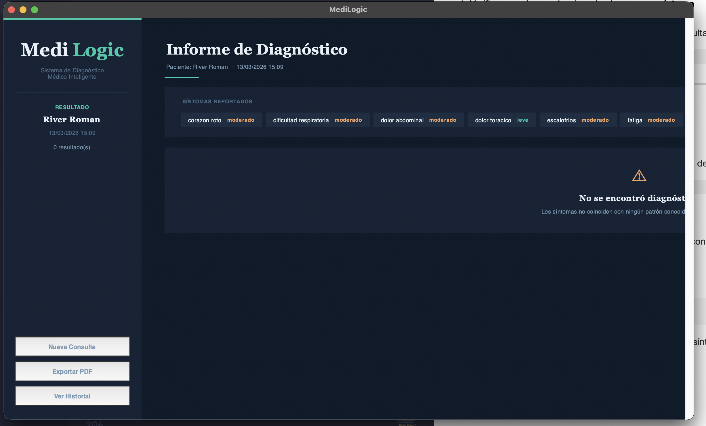
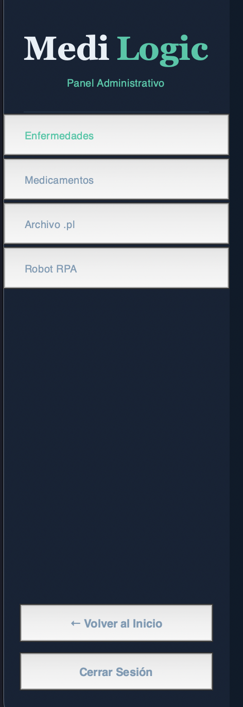
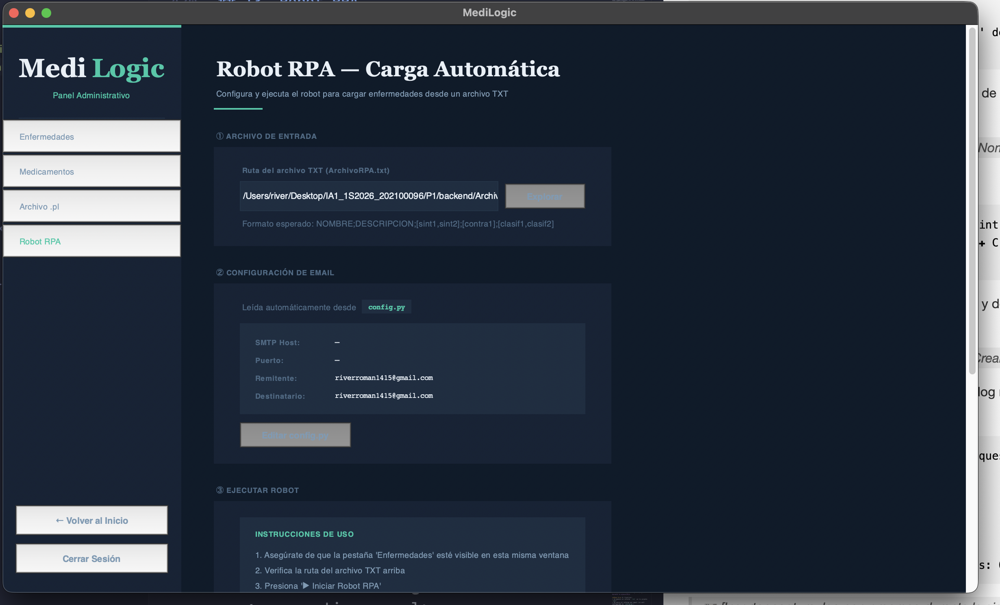

# Manual de Usuario — MediLogic
---
|**CARNET**  |      **NOMBRE COMPLETO**          |  
|----------|:-----------------------------------:|
|202100096 |  RIVER ANDERSON - ISMALEJ ROMAN     | 

---

## Tabla de Contenidos

1. [Introducción](#1-introducción)
2. [Requisitos del Sistema](#2-requisitos-del-sistema)
3. [Iniciar la Aplicación](#3-iniciar-la-aplicación)
4. [Pantalla de Inicio de Sesión](#4-pantalla-de-inicio-de-sesión)
5. [Pantalla de Inicio — Selección de Módulo](#5-pantalla-de-inicio--selección-de-módulo)
6. [Módulo Paciente](#6-módulo-paciente)
7. [Pantalla de Resultados del Diagnóstico](#7-pantalla-de-resultados-del-diagnóstico)
8. [Informe PDF Descargable](#8-informe-pdf-descargable)
9. [Módulo Administrador](#9-módulo-administrador)
10. [Gestión de Enfermedades](#10-gestión-de-enfermedades)
11. [Gestión de Medicamentos](#11-gestión-de-medicamentos)
12. [Gestión del Archivo .pl](#12-gestión-del-archivo-pl)
13. [Robot RPA](#13-robot-rpa)
14. [Errores Comunes y Soluciones](#14-errores-comunes-y-soluciones)
15. [Recomendaciones y Advertencias](#15-recomendaciones-y-advertencias)

---

## 1. Introducción

**MediLogic** es un sistema experto de escritorio que asiste en el proceso de diagnóstico médico preliminar. El sistema analiza los síntomas que usted reporta y los compara contra una base de conocimiento médica para sugerir posibles diagnósticos, niveles de urgencia y medicamentos recomendados.

---

## 2. Requisitos del Sistema

| Requisito | Especificación |
|---|---|
| Sistema Operativo | macOS 12+, Windows 10+, Ubuntu 20+ |
| Python | 3.12 o superior |
| SWI-Prolog | 9.x instalado y disponible en PATH |
| Memoria RAM | Mínimo 512 MB disponibles |
| Espacio en disco | 100 MB |
| Conexión a internet | Solo requerida para envío de email (RPA) |

---

## 3. Iniciar la Aplicación

### En macOS / Linux

```bash
cd P1/backend
source venv/bin/activate
python app.py
```

O usando el script incluido:

```bash
bash run.sh
```

### En Windows

```cmd
cd P1\backend
venv\Scripts\activate
python app.py
```

Al iniciar correctamente, aparecerá la ventana de inicio de sesión de MediLogic.


<p align="center">
    
</p>


---

## 4. Pantalla de Inicio de Sesión

Al abrir la aplicación verá la pantalla de login con el logo de MediLogic.

### Campos disponibles

| Campo | Descripción |
|---|---|
| **Usuario** | Nombre de usuario asignado |
| **Contraseña** | Contraseña del usuario |

### Credenciales por defecto

| Rol | Usuario | Contraseña |
|---|---|---|
| Administrador | `riverroman1415@gmail.com` | `admin` |

### Pasos para iniciar sesión

1. Escriba su nombre de usuario en el campo **Usuario**
2. Escriba su contraseña en el campo **Contraseña**
3. Haga clic en el botón **Ingresar**

<p align="center">
    
</p>


### Errores en el login

| Mensaje | Causa | Solución |
|---|---|---|
| "Credenciales incorrectas" | Usuario o contraseña equivocados | Verifique mayúsculas/minúsculas |
| No responde al hacer clic | Campos vacíos | Complete ambos campos |

---

## 5. Pantalla de Inicio — Selección de Módulo

Tras iniciar sesión correctamente verá la pantalla de inicio con dos opciones:

### Módulo Paciente
Haga clic en **"Módulo Paciente"** para iniciar una consulta diagnóstica. Este módulo está diseñado para que el paciente ingrese sus síntomas y reciba un diagnóstico preliminar.

### Módulo Administrador
Haga clic en **"Módulo Administrador"** para gestionar la base de conocimiento médica. Este módulo requiere credenciales de administrador.

<p align="center">
    
</p>


---

## 6. Módulo Paciente

El Módulo Paciente le permite reportar sus síntomas actuales y obtener un diagnóstico preliminar basado en la base de conocimiento del sistema.

<p align="center">
    
</p>

### 6.1 Datos del Paciente

Al ingresar al módulo, primero complete sus datos básicos:

- **Nombre:** Ingrese su nombre completo
- **Edad:** Ingrese su edad en años

### 6.2 Selección de Síntomas con Severidad

Esta es la sección más importante del módulo. Verá una lista de síntomas disponibles, cada uno con opciones de severidad.

#### Cómo reportar síntomas

1. **Active el síntoma** marcando la casilla (checkbox) junto a su nombre
2. **Seleccione la severidad** usando los botones de opción (radio buttons):
   - **Leve** — el síntoma es perceptible pero no interfiere significativamente
   - **Moderado** — el síntoma es molesto e interfiere con actividades
   - **Severo** — el síntoma es intenso y limita actividades normales

<p align="center">
    
</p>

#### Ejemplo de selección correcta

```
○ fiebre          ○ Leve  ● Moderado  ○ Severo
○ tos             ● Leve  ○ Moderado  ○ Severo  
○ dolor_cabeza    ○ Leve  ○ Moderado  ○ Severo
○ fatiga          ○ Leve  ○ Moderado  ● Severo
```

### 6.3 Enfermedades Crónicas

Si padece alguna enfermedad crónica conocida (diabetes, hipertensión, asma, etc.), selecciónela en esta sección. Esta información ayuda al sistema a ajustar el nivel de urgencia del diagnóstico.

- Seleccione tantas condiciones crónicas como apliquen
- Si no padece ninguna condición crónica, deje esta sección vacía

### 6.4 Alergias a Medicamentos

En el campo de texto de alergias, escriba los medicamentos a los que es alérgico, separados por coma.

**Ejemplo:** `penicilina, aspirina, sulfonamidas`

### 6.5 Obtener Diagnóstico

Una vez completada la información:

1. Verifique que haya seleccionado al menos **un síntoma**
2. Haga clic en el botón **"🔍 Obtener Diagnóstico"**
3. El sistema procesará la información y mostrará los resultados

<p align="center">
    
</p>


---

## 7. Pantalla de Resultados del Diagnóstico

Tras procesar sus síntomas, el sistema mostrará la pantalla de resultados.

### 7.1 Cómo interpretar los resultados

Cada diagnóstico sugerido se presenta como una **tarjeta** con la siguiente información:

#### Porcentaje de Afinidad

```
Gripe  ████████████████░░░░  78.5%
```

El porcentaje indica qué tan compatible es su conjunto de síntomas con esa enfermedad. Se calcula considerando:
- Cuántos síntomas de esa enfermedad reportó
- La severidad de cada síntoma reportado
- El total de síntomas posibles de esa enfermedad

| Rango | Interpretación |
|---|---|
| 70% – 100% | Alta compatibilidad — diagnóstico muy probable |
| 40% – 70% | Compatibilidad media — posible diagnóstico |
| 30% – 40% | Compatibilidad baja — diagnóstico posible pero poco probable |

#### Nivel de Urgencia

| Nivel | Color | Significado |
|---|---|---|
| **ALTA** | Rojo | Requiere atención médica inmediata |
| **MEDIA** | Naranja | Consulte a un médico pronto (24-48 horas) |
| **BAJA** | Verde | Puede esperar consulta de rutina |

#### Medicamentos Recomendados

El sistema lista los medicamentos que tratan la enfermedad y **no están contraindicados**. Si usted reportó alergias, los medicamentos contraindicados son excluidos automáticamente.

#### Descripción de la Enfermedad

Breve descripción clínica de la condición diagnosticada.

### 7.2 Múltiples diagnósticos

El sistema puede sugerir varios diagnósticos ordenados de mayor a menor compatibilidad. Esto es normal — muchas enfermedades comparten síntomas. Un médico evaluará cuál es el diagnóstico correcto en su caso específico.

### 7.3 Sin resultados

Si el sistema no muestra diagnósticos significa que:
- Los síntomas seleccionados tienen muy baja compatibilidad con las enfermedades conocidas (< 30%)
- No se seleccionaron suficientes síntomas

**Recomendación:** Revise si olvidó marcar algún síntoma y vuelva a intentarlo.

---

## 8. Informe PDF Descargable

En la pantalla de resultados puede generar y descargar un informe en formato PDF.

### Cómo descargar el informe

1. Haga clic en el botón **"Descargar Informe PDF"**
2. Seleccione la carpeta de destino en el explorador de archivos
3. El archivo se guardará con el nombre `diagnostico_[nombre]_[fecha].pdf`


### Contenido del informe PDF

El informe incluye:

- **Datos del paciente:** nombre, edad, fecha de consulta
- **Síntomas reportados:** lista con severidades
- **Enfermedades crónicas declaradas**
- **Resultados del diagnóstico:** hasta 5 diagnósticos con porcentaje y urgencia
- **Medicamentos recomendados** por diagnóstico
- **Advertencia legal** sobre el carácter no médico del sistema

### Cómo usar el informe

El informe PDF está diseñado para ser llevado a una consulta médica. Puede:
- Compartirlo con su médico para contextualizar los síntomas
- Guardarlo como referencia personal
- Enviarlo por correo electrónico

---

## 9. Módulo Administrador

El Módulo Administrador permite gestionar la base de conocimiento del sistema. Solo debe ser usado por personal autorizado.

La interfaz tiene una **barra lateral izquierda** con cuatro pestañas de navegación:

| Pestaña | Función |
|---|---|
| Enfermedades | Crear, editar y eliminar enfermedades |
| Medicamentos | Asociar medicamentos a enfermedades |
| Archivo .pl | Ver, exportar y cargar la base Prolog |
| Robot RPA | Configurar y ejecutar el robot de carga |

<p align="center">
    
</p>


---

## 10. Gestión de Enfermedades

### 10.1 Crear una nueva enfermedad

1. Asegúrese de estar en la pestaña **Enfermedades**
2. Complete el formulario en la parte superior:

| Campo | Descripción | Ejemplo |
|---|---|---|
| **Nombre** | Identificador único sin espacios | `neumonia_viral` |
| **Descripción** | Descripción clínica breve | `Infección viral del pulmón` |
| **Síntomas** | Lista separada por comas | `fiebre, tos, dificultad_respiratoria` |
| **Contraindicados** | Medicamentos contraindicados | `aspirina, ibuprofeno` |
| **Clasificaciones** | Categorías de la enfermedad | `viral, respiratorio, infeccioso` |

3. Haga clic en **"✚ Crear Enfermedad"**
4. Aparecerá un mensaje de confirmación si la operación fue exitosa
5. La nueva enfermedad aparecerá en la tabla inferior

#### Reglas para los nombres

- Use letras minúsculas
- Reemplace espacios por guión bajo `_`
- No use tildes ni caracteres especiales en el nombre identificador
- La descripción sí puede tener tildes y texto libre

#### Clasificaciones disponibles (recomendadas)

```
viral          bacteriano      fungico         parasitario
respiratorio   digestivo       cardiovascular  neurologico
endocrino      hepatico        renal           dermatologico
cronico        infeccioso      autoinmune
```

### 10.2 Editar una enfermedad existente

1. Seleccione la enfermedad en la tabla inferior haciendo clic sobre ella
2. Haga clic en **Cargar al formulario para editar"**
3. Los datos de la enfermedad se cargarán en el formulario
4. El título del formulario cambiará a **"EDITANDO: [NOMBRE]"** en color naranja
5. Modifique los campos que necesite
6. Haga clic en **"Actualizar Enfermedad"**


Para cancelar la edición y volver al modo de creación, haga clic en **"↺ Nuevo / Limpiar"**.

### 10.3 Eliminar una enfermedad

1. Seleccione la enfermedad en la tabla
2. Haga clic en **"Eliminar seleccionado"**
3. Confirme la eliminación en el diálogo que aparece.

---

## 11. Gestión de Medicamentos

En esta pestaña puede asociar medicamentos a enfermedades. Cada asociación se guarda como una relación `trata(medicamento, enfermedad)` en la base de conocimiento.

### Agregar un medicamento

1. Escriba el nombre del medicamento en el campo **"Nombre del medicamento"**
   - Use minúsculas y guión bajo para espacios: `acido_acetilsalicilico`
2. Seleccione la enfermedad en el menú desplegable **"Enfermedad que trata"**
3. Haga clic en **"✚ Asociar Medicamento"**

### Actualizar la lista de enfermedades

Si recientemente agregó enfermedades nuevas y no aparecen en el desplegable, haga clic en **"⟳ Recargar enfermedades"**.

### Eliminar una asociación

1. Seleccione la fila en la tabla **"MEDICAMENTOS REGISTRADOS"**
2. Haga clic en **"Eliminar asociación seleccionada"**
3. Confirme la eliminación

---

## 12. Gestión del Archivo .pl

Esta pestaña permite trabajar directamente con el archivo de la base de conocimiento Prolog.

### Ver el contenido actual

Haga clic en **"Ver .pl actual"** para mostrar el contenido completo del archivo `knowledge_base.pl` en el visor de texto.

### Exportar el archivo

1. Haga clic en **"Exportar .pl"**
2. Seleccione la carpeta de destino
3. El archivo se guardará con el nombre que elija

Use esta función para crear respaldos antes de realizar cambios importantes.

### Cargar un archivo externo

1. Haga clic en **"Cargar nuevo .pl"**
2. Seleccione el archivo `.pl` desde su equipo
3. Confirme el reemplazo en el diálogo
4. El motor Prolog se recargará automáticamente

---

## 13. Robot RPA

El Robot RPA (Robotic Process Automation) automatiza la carga masiva de enfermedades desde un archivo de texto, simulando la escritura manual en el formulario.

<p align="center">
    
</p>


### 13.1 Preparar el archivo de entrada

El robot lee el archivo `ArchivoRPA.txt` ubicado en la carpeta raíz del proyecto. El formato es:

```
NOMBRE;DESCRIPCION;[sint1,sint2,sint3];[contra1,contra2];[clasif1,clasif2]
```

**Ejemplo completo:**
```
neumonia_bacteriana;Infección bacteriana del tejido pulmonar;[fiebre,tos,dificultad_respiratoria,dolor_pecho];[aspirina];[bacteriano,respiratorio,infeccioso]
hepatitis_a;Infección viral hepática de transmisión fecal-oral;[nauseas,ictericia,fatiga,dolor_abdominal];[];[viral,hepatico]
```

**Reglas del formato:**
- Una enfermedad por línea
- Campos separados por `;` (punto y coma)
- Las listas van entre corchetes `[]`
- Elementos dentro de listas separados por coma sin espacios
- Si no hay contraindicados o clasificaciones, use `[]` vacío
- El nombre no debe tener espacios ni tildes

### 13.2 Verificar la configuración de email

La sección **CONFIGURACIÓN DE EMAIL** muestra los datos que se usarán para enviar la bitácora. Estos valores provienen de `config.py`.

Si necesita cambiar el email, haga clic en **"Editar config.py"**. Esto abrirá el archivo en su editor de texto predeterminado. Después de guardar los cambios, reinicie la aplicación para que surtan efecto.

### 13.3 Seleccionar el archivo TXT

1. En la sección **ARCHIVO DE ENTRADA**, verifique que la ruta apunte a su `ArchivoRPA.txt`
2. Si necesita cambiarla, haga clic en **"📂 Explorar"** y seleccione el archivo

### 13.4 Ejecutar el robot


Siga estos pasos exactamente:

**Paso 1:** Haga clic en **"▶ Iniciar Robot RPA"**

**Paso 2:** El log mostrará:
```
[HH:MM:SS] Iniciando Robot RPA...
[HH:MM:SS] Mueve el mouse al campo 'Nombre' del formulario
[HH:MM:SS] Tienes 4 segundos...
```
Mueva el mouse al campo **Nombre** del formulario de enfermedades y déjelo ahí durante 4 segundos.

**Paso 3:** El log mostrará:
```
[HH:MM:SS] ✓ Campo Nombre detectado en: Point(x=..., y=...)
[HH:MM:SS] Ahora mueve el mouse al botón '✚ Crear Enfermedad'
[HH:MM:SS] Tienes 4 segundos...
```
Mueva el mouse al botón **"✚ Crear Enfermedad"** y déjelo ahí durante 4 segundos.

**Paso 4:** El robot comenzará automáticamente. El log mostrará el progreso en tiempo real:
```
[HH:MM:SS] Iniciando en 3 segundos — NO toques el mouse
[HH:MM:SS] [1/3] → neumonia_bacteriana
[HH:MM:SS]   Clic en Crear Enfermedad
[HH:MM:SS]   ✓ Cargado correctamente
[HH:MM:SS] [2/3] → hepatitis_a
...
[HH:MM:SS] ═══ COMPLETADO — OK: 3 | Errores: 0 ═══
```

**Paso 5:** Al finalizar:
- Se genera un informe `.txt` en la carpeta `rpa/`
- Se envía el informe por email (si está configurado en `config.py`)
- La base de conocimiento se actualiza automáticamente

### 13.5 Abortar el robot

Si necesita detener el robot de emergencia, mueva el mouse rápidamente a la **esquina superior izquierda** de la pantalla. PyAutoGUI detectará esto y detendrá la ejecución.

---

## 14. Errores Comunes y Soluciones

### Errores al iniciar la aplicación

| Error | Causa | Solución |
|---|---|---|
| `ModuleNotFoundError: pyswip` | pyswip no instalado | `pip install pyswip` |
| `SWI-Prolog not found` | SWI-Prolog no está en PATH | Instalar SWI-Prolog y reiniciar terminal |
| `FileNotFoundError: knowledge_base.pl` | Ruta incorrecta en config.py | Verificar `PROLOG_FILE` en `config.py` |
| Ventana no aparece | Error en el event loop | Revisar la terminal para ver el traceback completo |

### Errores en el Módulo Paciente

| Situación | Causa | Solución |
|---|---|---|
| No hay síntomas en la lista | Base de conocimiento vacía | Agregar enfermedades desde el Admin |
| "Sin resultados de diagnóstico" | Afinidad < 30% en todas las enfermedades | Seleccionar más síntomas o con mayor severidad |
| Medicamentos muestran "ninguno" | No hay `trata/2` para esa enfermedad | Agregar medicamentos desde Admin → Medicamentos |

### Errores en el Módulo Administrador

| Situación | Causa | Solución |
|---|---|---|
| "El nombre de la enfermedad es requerido" | Campo Nombre vacío | Completar el campo antes de crear |
| Enfermedad no aparece en lista de medicamentos | No se ha recargado | Clic en "⟳ Recargar enfermedades" |
| Cambios no se guardan al reiniciar | `_persistir_pl()` falló | Revisar la terminal para ver el error; verificar permisos del archivo `.pl` |

### Errores en el Robot RPA

| Situación | Causa | Solución |
|---|---|---|
| "Archivo no encontrado" | Ruta del TXT incorrecta | Usar el botón "📂 Explorar" para seleccionar el archivo |
| El robot llena campos incorrectos | Orden de Tab incorrecto en el form | Asegurarse de hacer clic primero en el campo Nombre antes del inicio |
| Texto con tildes no se escribe bien | pyperclip no instalado | `pip install pyperclip` |
| Robot escribe en la pantalla equivocada | Ventana Admin no estaba al frente | Asegurarse de que la pestaña Enfermedades sea visible antes de iniciar |
| `FailSafeException` | Mouse llegó a esquina superior-izquierda | Es el mecanismo de seguridad — reinicie el robot |
| Email no se envía | Credenciales SMTP incorrectas | Verificar usuario/password en `config.py`; usar App Password para Gmail |

### El sistema muestra diagnósticos incorrectos o inesperados

Esto puede ocurrir si:
- Los síntomas fueron reportados con severidad incorrecta
- La base de conocimiento tiene información incompleta para esa enfermedad
- Se reportaron muy pocos síntomas

**Recomendación:** Revise los síntomas seleccionados y asegúrese de marcar todos los que presenta. Consulte siempre a un médico para confirmación.

---

## 15. Recomendaciones y Advertencias

### Recomendaciones generales

- **Antes de realizar cambios importantes en la base de conocimiento**, exporte el `.pl` actual desde Admin → Archivo .pl → "Exportar .pl". Esto crea un respaldo que puede restaurar si algo sale mal.

- **Para el Robot RPA**, prepare y verifique el `ArchivoRPA.txt` antes de ejecutar el robot. Un formato incorrecto en el archivo puede causar cargas parciales o errores.

- **Mantenga la base de conocimiento actualizada.** Los medicamentos y síntomas registrados determinan directamente la calidad de los diagnósticos.

- **No cierre la aplicación durante la ejecución del Robot RPA.** Espere a que el log indique "COMPLETADO" antes de realizar cualquier acción.

- **Use nombres consistentes** para síntomas y medicamentos. Si el mismo síntoma está registrado como `dolor_cabeza` en una enfermedad y `dolor_de_cabeza` en otra, el sistema los tratará como síntomas diferentes.